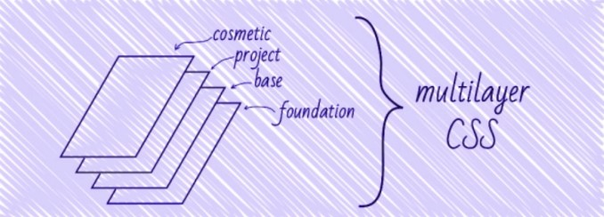

## OOCSS
  面向对象的CSS，主要思想是 **“结构和设计的分离，容器和内容的分离”**  
  简单的说就是**抽象公共类**，把复用度高的样式抽取出来，例如：
  ```css
    .mt20 { margin-top: 20px }

    .tc { text-align: center }

    .abs { position: absolute }

    .clearfix:after { content: ‘’; display: block; clear: both; height: 0 }
  ```
  这种方案的思路是通过提高复用性，减少命名的需要，因为有的样式直接用公共类名就能实现，不需要额外命名。  
  它的缺点是滥用就可能付出代价，比如有10个组件用同一个普通类名，那么修改样式只需要改一处CSS即可，但是在10个组件上用同一个公共类名比如mt20，意味着把mt20改成mt15，你需要改10处的class。所以公共样式少用公共类，不要图省事儿。  

  [OOCSS的概念介绍](https://www.w3cplus.com/css/oocss-concept)

## SMACSS
  **可扩展和模块化结构** CSS 的一个简称。  
  主要目标是 **减少代码量，简化代码的维护**。  
  在整个系列中，包括了base，modules，staes，themes。修饰符使用的是--，子模块使用__符号。
  - Base 基本规则，整体样式，比如 body、input、button、form
  - Layout 布局规则，比如 顶部，页脚，边栏，模块的大小等
  - Module 可复用的模块样式规则
  - State 状态样式 比如 隐藏 当前高亮
  - Theme 主题 控制整体UI

   针对不同分类，可以使用不同的前缀来划分命名空间，就不多赘述了。

## Atomic CSS
  **原子化 CSS 结构。**

  优点是可以写基础 视觉功能小的，单用途的 CSS，相当于把每一个单一的作用定义一个Class，确保整个样式表没有一条重复的样式，这样复用性是最高的，代码也最少，但是每个元素就需要一堆的 Class。

  这种思路可谓另辟蹊径，独树一帜。当然优缺点都很明显：CSS 代码最小化了，而 HTML 膨胀了；虽然不用考虑命名，但是要记一堆新规则。

  ```html
  <div class="mt-10 w-100 h-15"></div>
  // mt-10 > margin-top: 10px;
  // w-100 > width: 100px;
  // h-15 > height: 15px;
  ```

## MCSS

  多层级的CSS  
    

## AMCSS
  针对属性的CSS设计  
  AMCSS是Attribute Modules for CSS的缩写，表示借助HTML属性来进行CSS相关开发。  

  传统我们多个模块特性是通过多个类名进行控制的，典型如下：  
  `<div class="button button-large button-blue">Button</div>`  

  而AMCSS则是基于属性控制，例如：  
  `<div button="large blue">Button</div>`  

  为了避免属性名称冲突，我们可以加一个统一的前缀，例如am-，于是有：  
  `<div am-button="large blue">Button</div>`  

  此技术能够实行离不开这个一个选择器：**`[attr~=”val”]`**。

  [AMCSS官网](http://amcss.github.io/)

  ## BEM
    Block  块
      header container content menu
    Element  元素
      menu-item, list-item, head-title
    Modifier  修饰符
      checked, disabled, highlighted, fixed, size-big, color-red

  ```html
  <!-- 无状态按钮 -->
  <button class="button"> Normal button </button>

  <!-- 成功状态的按钮 -->
  <button class="button--state-success"> Success button </button>
  
  <!-- 危险状态的按钮 -->
  <button class="button--state-danger"> Danger button </button>
  ```