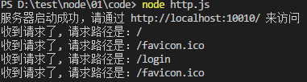

1.  加载 http 模块

```javascript
const http = require('http')
```

2. 使用 http.createServer() 方法创建一个 web 服务器

```js
const server = http.createServer()
```

3.  注册 request 请求事件

```javascript
server.on('request', (request, response) => {

  console.log('收到请求了, 请求路径是：' + request.url)

  let url = request.url

  // 使用 response 响应请求

  if(url === '/'){

    response.write('index')

    response.end('over')

  }

  if(url === '/login'){

    response.write('login')

    response.end('over')

  }

  if(url === '/register'){

    response.write('register')

    response.end('over')

  }

})

```

4.  绑定端口号， 启动服务器

```javascript
server.listen(10010, () => {

  console.log('服务器启动成功，请通过 http://localhost:10010/ 来访问')

})

```

