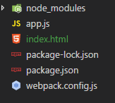
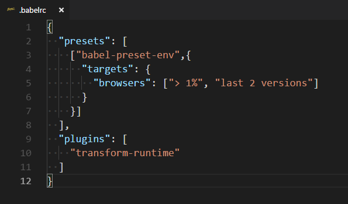
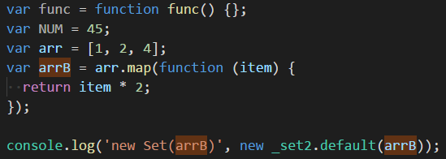

# 编译ES6 7

- 需要安装的 loader `babel-loader`

  - 安装最新版的 `npm install babel-loader`
  - 一般安装 `npm install --save-dev babel-loader babel-core`

- 新建一个文件夹 `demo`，进入 `cd demo` ，然后初始化一下 `npm init -y`，完成后文件夹内会多一个 `package.json`和 `package-lock.json` 的配置文件。

- 安装需要的 loader 按上述命令安装即可。

- 安装完成后，在项目目录内创建 `app.js` `index.html` `webpack.config.js`

  

- 编辑 `webpack.config.js` 配置文件，增加入口 `entry` 与出口 `output`

  - ```
    module.exports = {
    	entry: {
        	app: './app.js'
      	},
      	output: {
        	filename: '[name].[hash:5].js'
      	},
      	module: {
        	rules: [
          		{
                    test: /.js$/,
                    use: 'babel-loader',
                    exclude:'/node_modules/'
          		}
        	]
     	 }
    }
    
    ```

    

- 此时还需要一个 `babel-presets` 规范的插件

  - `npm install @babel/preset-env --save-dev` 如果 `babel-loader` 是安装的最新版的，就使用这一句。
  - `npm install babel-preset-env --save-dev` 如果`babel-loader` 是安装的一般的，就使用这一句。

- 安装完成后，我们需要给我们安装的 loader 指定一个 preset 。

  - 修改 use  

    ```
    use: {
    	loader: 'babel-loader',
    	options: {
    		presets: [
                  ['babel-preset-env',{
                    targets: {
                      browsers: ['> 1%', 'last 2 versions']
                    }
                  }]
    		]
    	}
    },
    ```

- 在 `app.js` 文件中添加一些东西，来打包编译一下。

  ``` 
  let func = () => { }
  const NUM = 45
  let arr = [1, 2, 4]
  let arrB = arr.map(item => item * 2)
  
  console.log('new Set(arrB)', new Set(arrB));
  ```

- 运行 `webpack ` 打包成功

  ```
  PS D:\test\my-webpack\3-3> webpack
  Hash: c51e1f6c979a6f1f782b
  Version: webpack 3.10.0
  Time: 565ms
         Asset     Size  Chunks             Chunk Names
  app.c51e1.js  2.68 kB       0  [emitted]  app
     [0] ./app.js 186 bytes {0} [built]
  ```

- 但是此时我们观察一下打包好的文件，发现有些还是没有转换。只能针对语法进行了转换，函数和方法是没有转换的，所以还需要两个插件。

  - `Babel Polyfill` 全局垫片，引入之后会在全局进行变量定义，可以理解为会污染全局变量。为应用准备的插件。使用方法 `npm install babel-polyfill --save`

  - `Babel Runtime Transform` 局部垫片，为了开发框架而准备的，不会污染全局。

    使用方法

     `npm install babel-plugin-transform-runtime --save-dev`

     `npm install babel-runtime --save`

- 把上述的两个插件都安装上 

  `npm install babel-polyfill babel-runtime --save`

  `npm install babel-plugin-transform-runtime --save-dev`

- 使用 ` babel-polyfill` 时，在 `app.js` 中 `import`

- 使用 `babel-runtime` 时，在根目录 新建 `.babelrc` 文件 用来配置。

  - 把 `presets ` 移动到 `.babelrc` 文件中。

  - 再增加一个 `plugins` 

    

  - 运行 `webpack` 打包成功

    - ``` 
      PS D:\test\my-webpack\3-3> webpack
      Hash: 04b45de1843b1e27155f
      Version: webpack 3.10.0
      Time: 1627ms
             Asset     Size  Chunks             Chunk Names
      app.04b45.js  73.2 kB       0  [emitted]  app
        [60] ./app.js 386 bytes {0} [built]
          + 121 hidden modules
      ```

    - 查看新编译的文件，找到自己写的代码，发现已经全部被转换了。

> 一般在应用开发中，我们只需要使用 ` babel-polyfill`  在入口文件中 `import 'babel-polyfill'` 就可以使用ES6 这些新语法了。