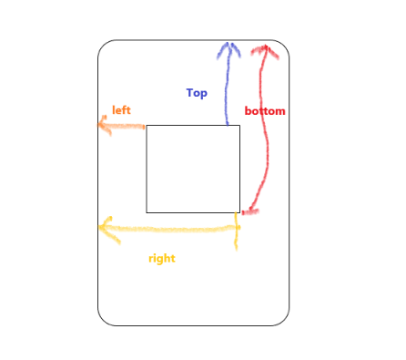

## 页面布局
  - 假设高度已知，请写出三栏布局，其中左栏、右栏宽度各为300px,中间自适应
      - 浮动布局
      - 定位布局
      - flexbox布局
      - 表格布局
      - 网格布局
      - [代码实例点这里](./DOM/三栏布局.html)
  - 高度未知，左右固定宽度，中间自适应
  - 上下高度固定，中间自适应
  - 左侧固定，右侧自适应
  - 右侧固定，左侧自适应
  - 左右高度自适应同步
## CSS盒模型
  - 基本概念：W3C标准模型 和 IE模型
      - `margin`,`border`,`padding`,`content`
  - 区别：
      - 高度与宽度的计算方式不同
      - W3C标准盒模型的宽高 === `content` 的宽高
      - IE盒模型的宽高 === `content + padding + border`
  - CSS如何设置盒模型
      - `box-sizing: content-box` W3C标准模型 （浏览器默认）
      - `box-sizing: border-box` IE模型

  - JS如何设置和获取盒模型对应的宽，高
      1. `dom.style.width/height` 只能取到行内样式的，style标签内定义的样式和 link外链的样式是取不到的。
      2. `dom.currentStyle.width/height` 可以取到页面渲染完成后，DOM节点上的当前样式，但是只有 IE浏览器 才支持。
      3. `window.getComputedStyle(dom).widht/height` 此种方式与`currentStyle` 作用相同，但是兼容更多浏览器，通用性更好。
      4. `dom.getBoundingClientRect().width/height` **getBoundingClientRect**用于获取某个元素相对于视窗的位置集合。集合中有top, right, bottom, left等属性。

  - 边距重叠解决方案(BFC)  
      - 什么是BFC？
          1. `Block Formatting Context` 块级格式化上下文，W3C的定义：  
            > 浮动元素和绝对定位元素，非块级盒子的块级容器（例如 `inline-blocks`, `table-cells`, 和 `table-captions`），以及`overflow`值不为`“visiable”`的块级盒子，都会为他们的内容创建新的BFC（块级格式上下文）。
          2. BFC是一个独立的布局环境，其中的元素布局是不受外界的影响，并且在一个BFC中，块盒与行盒（行盒由一行中所有的内联元素所组成）都会垂直的沿着其父元素的边框排列。
          3. BFC的区域不会与浮动区域的容器重叠
          4. BFC是一个页面上的独立的容器，外面的元素不会影响BFC里的元素，反过来，里面的也不会影响外面的
          5. 计算BFC高度的时候，浮动元素也会参与计算
      - 如何创建BFC ?
          1. `float` 的值不为 `none`
          2. `position` 的值不为 `static`或者 `relative`
          3. `display` 的值为 `table-cell`,`table-caption`,`inline-block`,`flex`,`inline-flex`中的其中一个
          4. `overflow` 的值不为 `visible`

    
## DOM事件
  - DOM事件的级别
    - DOM0 `element.onclick = function(){}` || ``
        1. 直接绑定到DOM节点上的
        2. 清理 DOM0 事件时，只需要给该事件赋值为 null 。`element.onclick = null`
        3. 同一个元素的同一种事件只能绑定一个函数，否则后面的函数会覆盖之前的函数
        4. 不存在兼容性问题

    - DOM2 `element.addEventListener('click', function(){}, false)` || IE `element.attachEvent('onclick', function(){})` 
        1. dom2 是通过 `addEventListener` 绑定事件。
        2. 同一个元素可以绑定多个事件，按照绑定顺序执行
        3. 清楚事件时，使用 `removeEventListener`。不能移除匿名添加的函数  
          `input.removeEventListener( "click" ,a)`
        4. `addEventListener` 有三个参数
            - 第一个参数是事件名
            - 第二个参数是事件处理函数
            - 第三个参数是 true 表示在捕获阶段调用，false 表示在冒泡阶段调用。
    - DOM3 绑定方式和DOM2相同，新增了更多的事件类型。同时也允许自定义事件。

  - DOM事件模型
      - 捕获
          - 从外层到内层
      - 冒泡
          - 从内层到外层

  - DOM事件流

  - DOM事件捕获的具体流程

  - Event对象的常见应用

  - 自定义事件

## HTTP协议
  http  https  http2
## 面向对象

## 原型链

## 通信
  跨域
## 安全
  XSS

## 算法